<div align="center">
  <picture>
    <source media="(prefers-color-scheme: dark)" srcset="docs/images/logo-dark.svg" />
    
  </picture>
</div>


---


# uniFlow: Unified Workflow for Technical Service Management

> 🏆 **Outstanding Performance Award (1st place)**: Capstone Project Competition 2025, National Taiwan University of Science and Technology (NTUST)

**uniFlow** replaces the phone-call-and-chat-message workflow that many on-site repair companies still rely on. Every physical device (air conditioners, refrigerators, network equipment…) gets a QR code linked to the device and the company that owns it. Scanning the code opens a report form, the request lands on an operator dashboard in real time, and a technician handles the job on-site through a mobile app, scanning the same QR code to prove they are there. Clients are kept informed by email and can rate the service when it is done.

This repository contains the **three frontends**. The NestJS + PostgreSQL backend lives in [vawms/backend-capstone](https://github.com/vawms/backend-capstone).

---

<div align="center">
  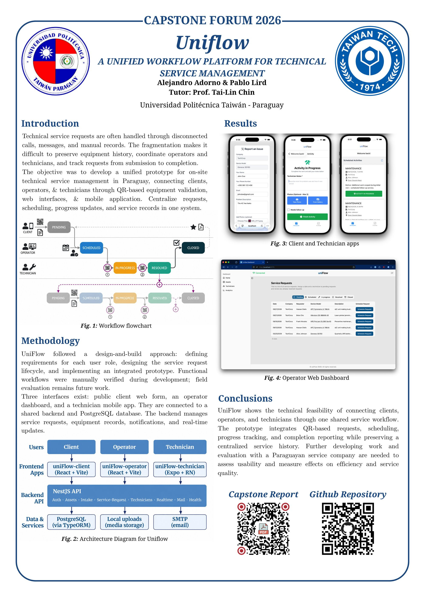
</div>

---

## 👥 Team

uniFlow was built by a team of two as a capstone project during an exchange semester at NTUST.

| Part | Author |
| --- | --- |
| Frontends: client web form, operator dashboard, technician mobile app (this repo) | [Pablo Lird](https://github.com/pablolird) |
| Backend API, database, email and PDF reports ([backend-capstone](https://github.com/vawms/backend-capstone)) | [@vawms](https://github.com/vawms) |

---

## 🔄 How It Works

<div align="center">
  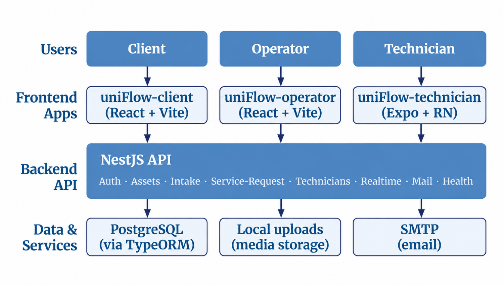
</div>

<details>
<summary><b>Detailed architecture</b> (endpoints, modules, storage)</summary>
<br>
<div align="center">
  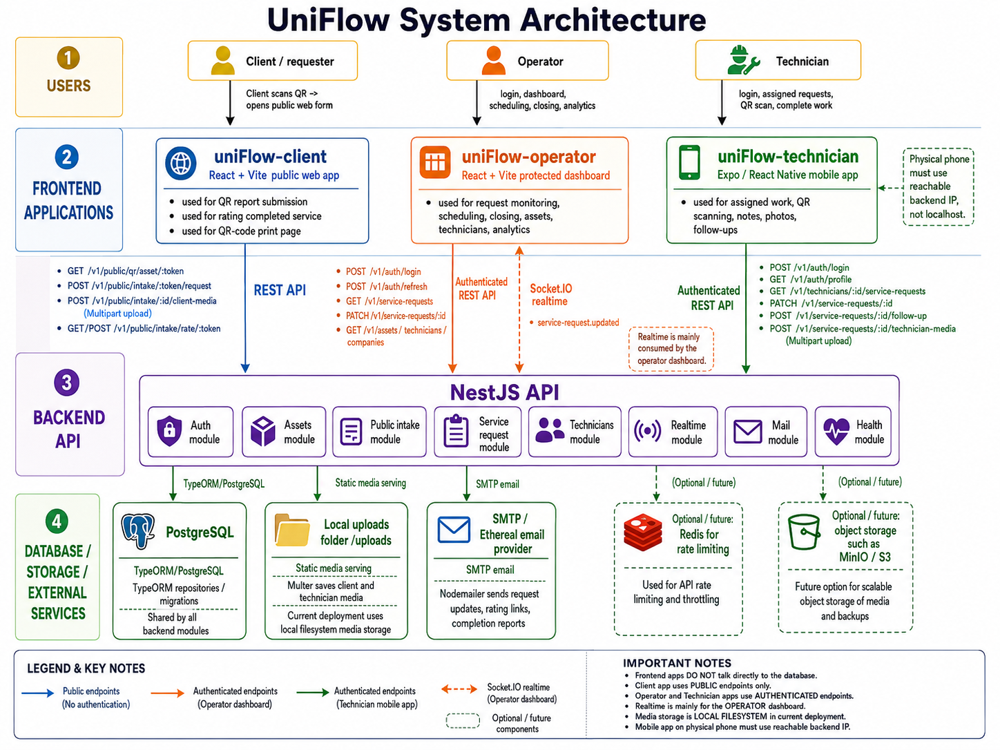
</div>
</details>

1. **Report (client).** Anyone scans the device's QR code, describes the issue, and attaches photos. No account is needed.
2. **Schedule (operator).** The request appears live on the operator dashboard. The operator reviews it, picks a date, and assigns a technician.
3. **Fix (technician).** The technician sees the job, its location, the device, and the client's description and photos in the mobile app. They scan the device's QR code to **start** the job and again to **finish** it, adding notes and photos. If another visit is needed, they create a linked **follow-up request**.
4. **Close (operator and client).** The operator reviews and closes the request. The client receives a PDF completion report and a link to rate the service.

### Request lifecycle

<div align="center">
  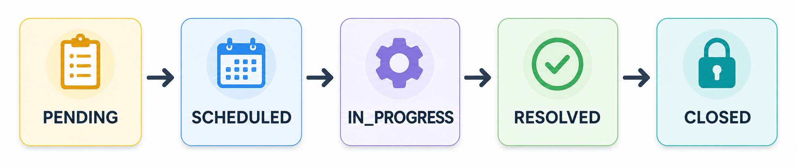
</div>

Each role moves the request forward. The technician's two QR scans (① start, ② finish) gate the `IN_PROGRESS` and `RESOLVED` transitions, and a resolved job can spawn a linked follow-up request that starts the cycle again:

<div align="center">
  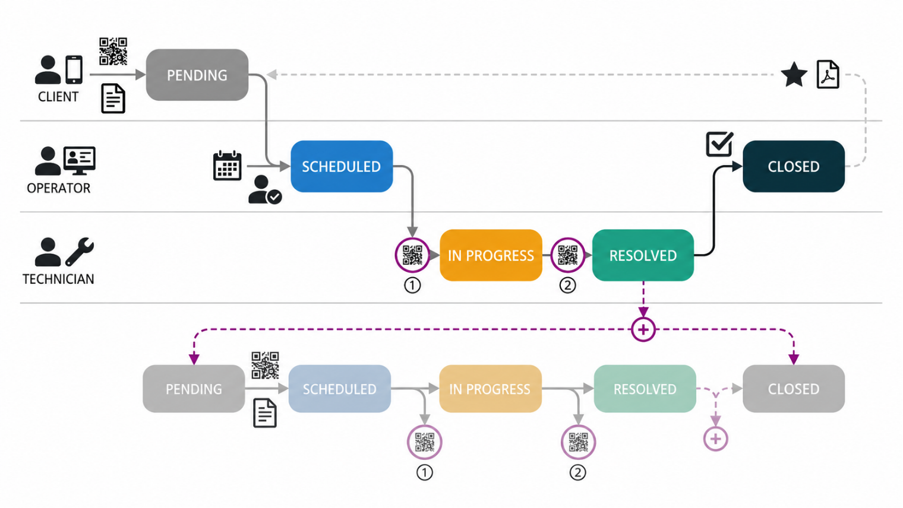
</div>

Every transition is pushed to open dashboards over WebSockets, so there is no polling or page refresh.

---

## 🌟 Features

- **QR-based intake.** Each device has a unique QR code tied to it and its owner company. A printable QR codes page is included.
- **Photo attachments.** Clients attach photos to their reports, and technicians attach photos when resolving a job.
- **Real-time dashboard.** Socket.io events update request rows in place and raise toast notifications.
- **QR-gated jobs.** Technicians must scan the device's code to start and to finish a job, which confirms they are on-site.
- **Follow-up requests.** Unfinished work spawns a linked child request that goes back to the operator's queue.
- **Ratings.** Clients rate the service after the request is closed.
- **Analytics.** Status counts, weekly request volume, follow-up rate, and workload per technician.
- **Asset and technician views.** Browse each device's and each technician's request history.
- **Secure sessions.** Operator access tokens live only in memory, and sessions are silently renewed through an HttpOnly refresh cookie.

---

## 📱 Front-Ends

### 1. Client Web Form (`uniFlow-client`)

<div align="center">
  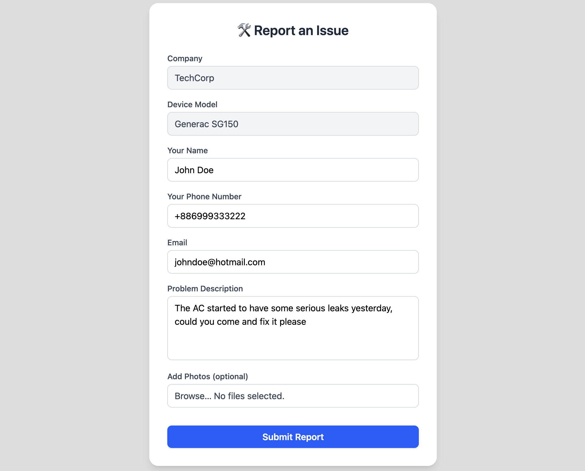
  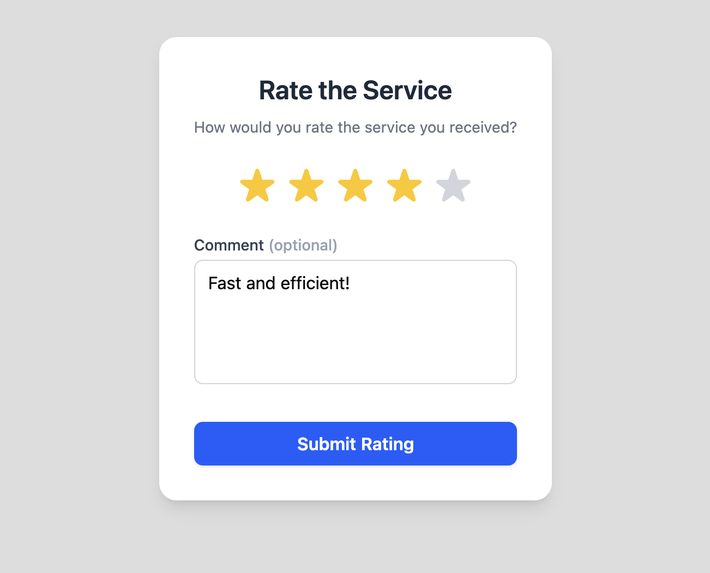
</div>

The public page opened by scanning a device's QR code. It contains the service request form (with photo upload), the rating page, and a printable page of every asset's QR code.

<div align="center">
  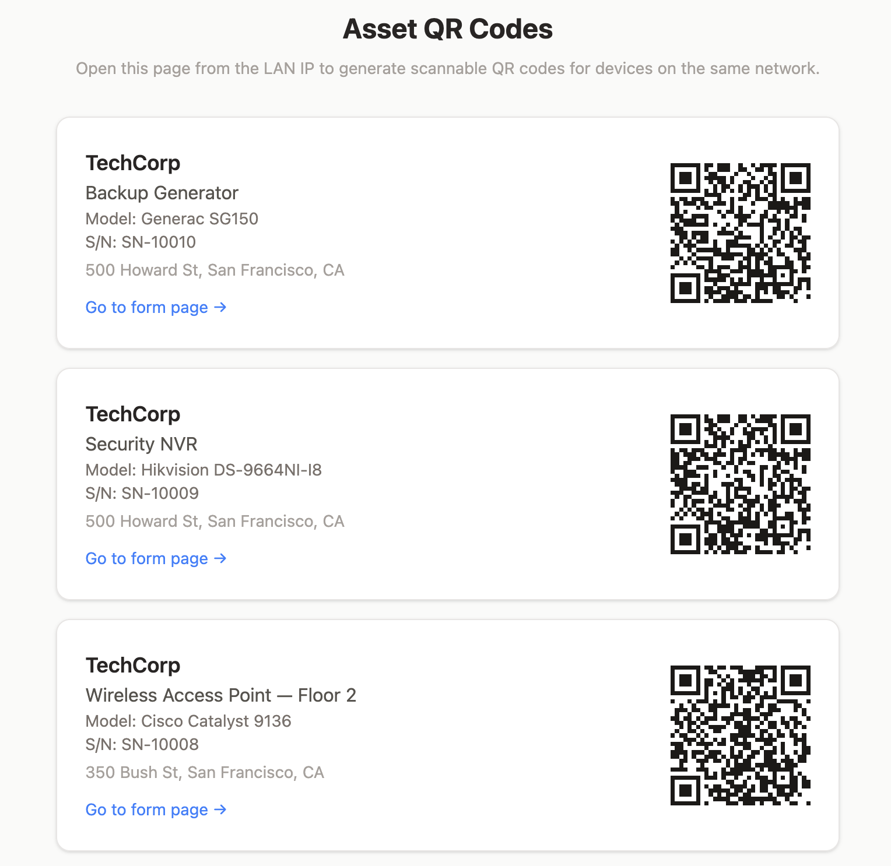
</div>

**Stack:** React 19 · Vite · Tailwind CSS 4 · React Router · Axios · qrcode.react

---

### 2. Operator Dashboard (`uniFlow-operator`)

<div align="center">
  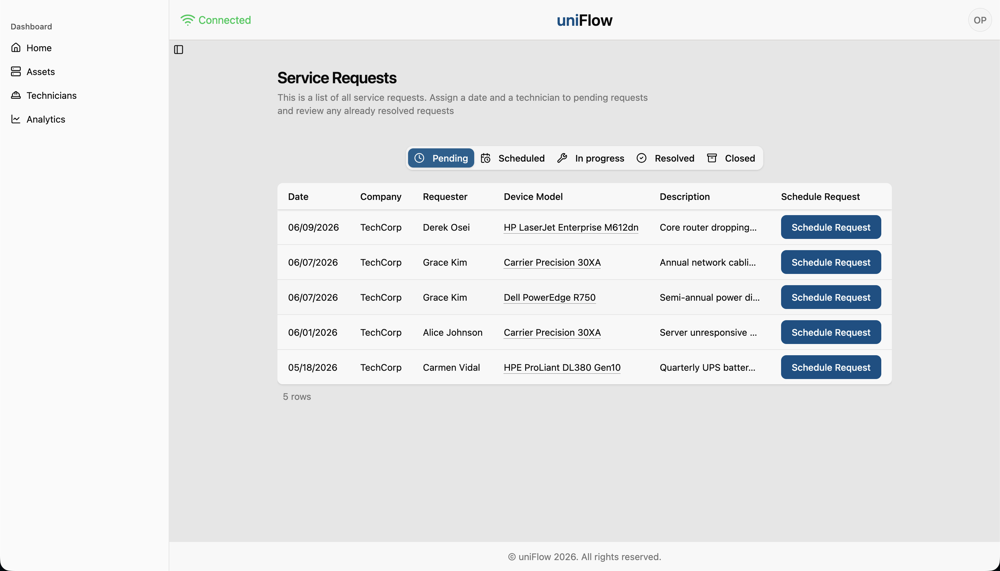
</div>

A login-protected dashboard for managing every request: browse requests by status, schedule and assign technicians, close resolved work, browse assets and technicians, and view analytics. Status changes from technicians appear instantly across all open sessions.

<div align="center">
  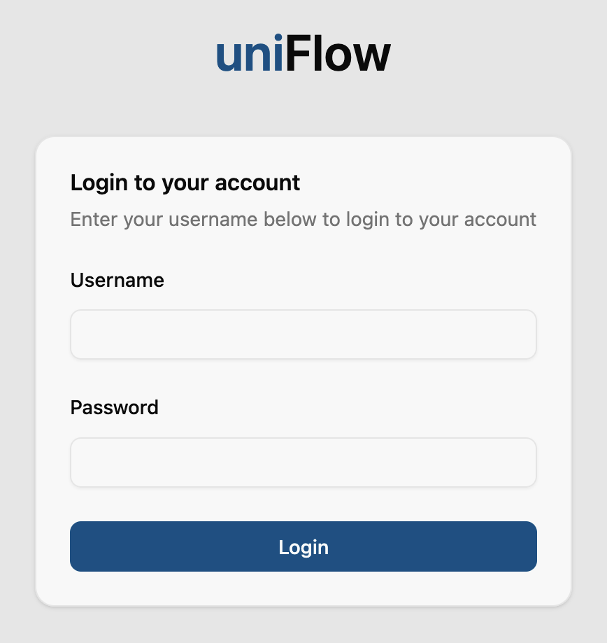
  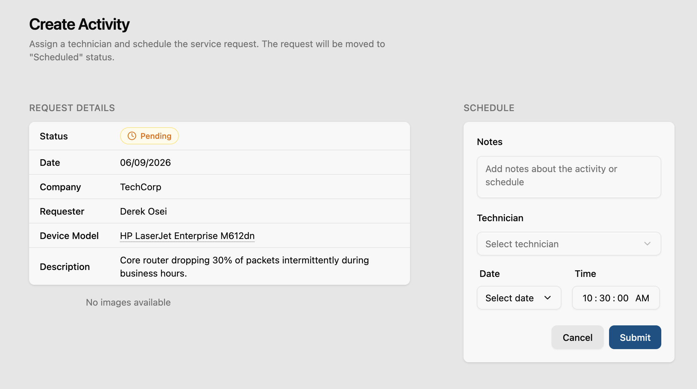
</div>
<br>
<div align="center">
  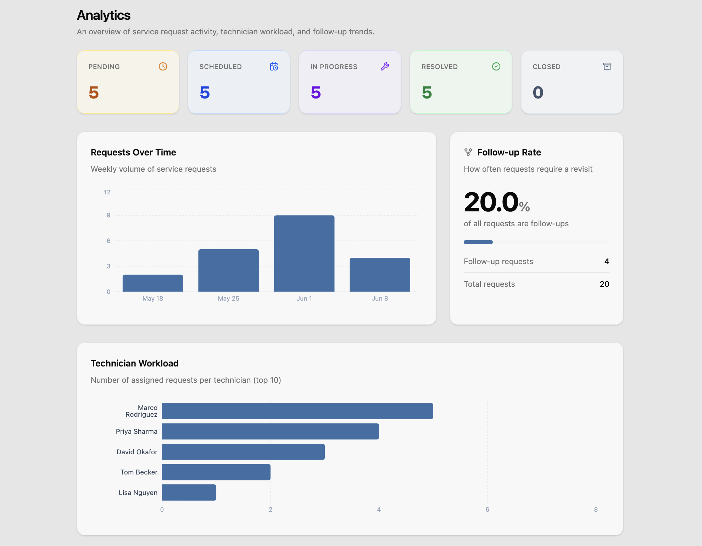
</div>

**Stack:** React 19 · Vite · Tailwind CSS 4 · shadcn/ui (Radix) · TanStack Table · TanStack Query · React Hook Form + Zod · Recharts · Socket.io client

---

### 3. Technician Mobile App (`uniFlow-technician`)

A React Native app for field technicians. It lists scheduled and finished jobs, shows each job's location, device, and the client's report, and uses the camera to scan the device's QR code at the start and end of each job. Technicians resolve jobs with notes and photos, or create a follow-up request.

<div align="center">
  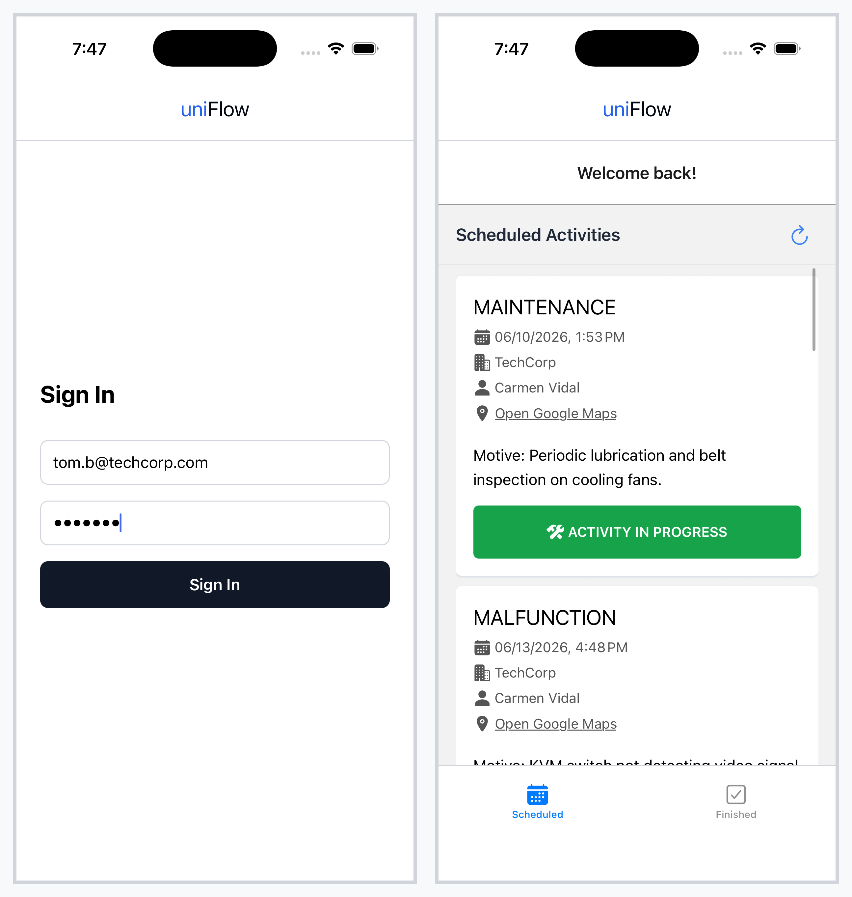
  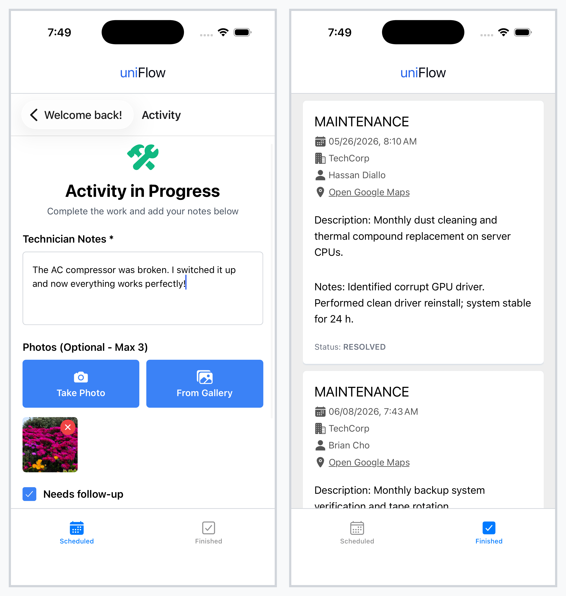
</div>

**Stack:** React Native · Expo SDK 54 · Expo Router · NativeWind · expo-camera · expo-image-picker

---

## 🛠️ Technologies

| Layer              | Technology                                                                              |
| ------------------ | --------------------------------------------------------------------------------------- |
| Client Form        | React 19, Vite, Tailwind CSS 4, React Router, Axios                                     |
| Operator Dashboard | React 19, Vite, Tailwind CSS 4, shadcn/ui, TanStack Table & Query, Recharts, Socket.io  |
| Technician App     | React Native, Expo SDK 54, Expo Router, NativeWind, expo-camera                         |
| Real-Time          | Socket.io (WebSockets)                                                                  |
| Language           | JavaScript / TypeScript                                                                 |
| Backend            | NestJS, TypeORM, PostgreSQL: see [backend-capstone](https://github.com/vawms/backend-capstone) |

---

## 📂 Project Structure

```
uniFlow/
├── api.py                  # Sets the backend URL in all three apps' .env files
├── start-dev.sh            # Starts all three frontends in one tmux session
│
├── uniFlow-client/         # Public QR landing page (web)
│   └── src/
│       ├── pages/          # ReportForm, RatingPage, QrsPage, NotFound
│       └── components/     # Form, RatingForm, StatusCard, Success, Loading
│
├── uniFlow-operator/       # Operator dashboard (web)
│   └── src/
│       ├── routes/         # Dashboard, ShowRequest, ScheduleRequest, CloseRequest,
│       │                   # Assets, Technicians, Analytics, Login
│       ├── context/        # Auth, requests + Socket.io, overlays
│       ├── hooks/          # Data-fetching hooks
│       └── components/     # Request views, forms, sidebar, ui/ (shadcn primitives)
│
└── uniFlow-technician/     # Technician mobile app (React Native / Expo)
    ├── app/                # Expo Router screens: sign-in, jobs, job detail, QR scanner
    ├── components/         # ServiceCard, ActivityInfo, ActivityInProgress, FinishedCard
    ├── contexts/           # Auth and service-request providers
    └── services/           # API client
```

---

## 🚀 Running Locally

### Prerequisites

- Node.js 18+
- Docker (for the backend)
- Expo Go on a phone, or an iOS/Android simulator
- The backend running: see [backend-capstone](https://github.com/vawms/backend-capstone) (`./scripts/qa.sh` starts the API and a seeded database on port 3000)

### 1. Clone and install

```bash
git clone https://github.com/pablolird/uniFlow.git
cd uniFlow
(cd uniFlow-client && npm install)
(cd uniFlow-operator && npm install)
(cd uniFlow-technician && npm install)
```

### 2. Point the apps at the backend

```bash
python3 api.py <your-backend-ip>:3000
```

This writes `VITE_API_BASE_URL` (client and operator) and `EXPO_PUBLIC_API_BASE_URL` (technician) to each app's `.env`. Use your machine's LAN IP rather than `localhost` so the phone can reach the backend.

### 3. Run

All at once (requires tmux):

```bash
./start-dev.sh
```

Or individually:

```bash
cd uniFlow-client && npm run dev                          # http://localhost:5555
cd uniFlow-operator && npm run dev -- --port 4000         # http://localhost:4000
cd uniFlow-technician && npx expo start                   # scan the QR with Expo Go
```

Seed logins from the backend's QA setup: operator `operator` / `operator123`, technician `sarah.m@techcorp.com` / `tech123`.

---

## 🔗 Related

- **Backend**: [vawms/backend-capstone](https://github.com/vawms/backend-capstone)

---

<p align="center">Built for the NTUST Capstone Project Competition 2025</p>
